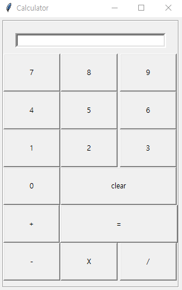

# Complex-Calculator : unit converter + calculator

### 1. 프로젝트 소개
기존의 분리된 계산기와 단위 변환기를 통합하여 보완, 개선하고자 이 프로젝트를 기획하였다.

### 2. 실행 요구조건

Python 3.6+

math(standard module in PyPl)

tkinter (tkinter can be installed using; `pip install tkinter`)

### 3-1. 지원 단위

|카테고리|	단위|
|------|---|
|Temperature|Celsius (C), Fahrenheit (F), Kelvins (K)|
|Distance|Metric distances: milimeter (mm), centimeter (cm), meter (m), kilometer (km),Imperial distances: inch (in), foot (ft), yard (yd),mile (mile)|
|Mass and Weight|	gram (g), milligram (mg), killogram (kg), ounce (oz), pound (lb)|
|Time|	second (s), minute (min), hour (hour), day (day), year (year)|
|Speed|	kilometers per hour (k/h), knots (kt), kilometers per second (km/s), meter per second(m/s), meter per hour(m/h), mach (mach)|

### 3-2. 기능
- Addition
- Subtraction
- Multiplication
- Division
- Square
- Cube
- Square root
- Cube root
- Factorial
- Sin
- Cos
- Tan
- 여러 문자열 연산 지원
- 사용자의 편의를 위한 버튼 형식 GUI 제공

  ### 4. 예시 (미완성/ 디자인 예시 사진)
  
  
